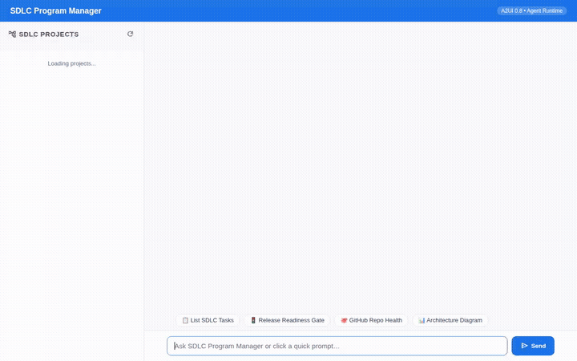

# 🚀 SDLC Program Manager Orchestrator

A conversational orchestrator agent that automates software delivery pipelines, coordinates specialized software development lifecycle (SDLC) stages, evaluates production release readiness, and maintains durable cross-session memory of release incidents on Google Cloud.

<div align="center">



</div>

---

## 📌 Overview

The **SDLC Program Manager Orchestrator** manages initiatives across four key software lifecycle stages:
1. **Requirements (PRD)**
2. **Coding (Implementation)**
3. **Testing (Quality Assurance & E2E)**
4. **Deployment (Canary & Production Gates)**

The agent coordinates deliverable tracking, automates task status transitions, queries repository health, synthesizes architecture diagrams and milestone animations, and calculates real-time **GO / NO-GO** release readiness recommendations.

---

## 🛠️ Implemented Capabilities & Wired Cloud Services

Every tool and cloud service listed below is wired directly into the codebase in `sdlc-program-manager/app/agent.py` and `agents-cli-manifest.yaml`:

### 1. 🧠 Long-Term Memory (Vertex AI Memory Bank)
- **Service**: Agent Platform Vertex AI Memory Bank (`MEMORY_BANK_ID: 1177086571162107904`, region: `us-east1`).
- **Wiring**:
  - `PreloadMemoryTool()` automatically injects relevant long-term memories and past release context at the beginning of each conversation turn.
  - `generate_memories_callback` runs as an `after_agent_callback` (`add_session_to_memory`) after every turn to extract durable release incident records, failed gates, recurring blockers, and project preferences.

### 2. 🗄️ Structured Task & Gate Tracking (Google Cloud Firestore)
- **Database**: Native Firestore collection `sdlc_tasks`.
- **Tools**:
  - `list_sdlc_tasks(stage)`: Fetches tasks from Firestore with optional pipeline stage filtering (`Requirements`, `Coding`, `Testing`, `Deployment`).
  - `get_sdlc_task(task_id)`: Retrieves complete task attributes, deliverables, and dependencies by ID.
  - `save_sdlc_task(task_id, title, description, stage, sub_agent, status, priority, deliverables, blockers)`: Creates or merges new SDLC tasks in Firestore.
  - `update_task_status(task_id, status, blocker)`: Updates task progress and appends blocker notes.
  - `evaluate_release_readiness()`: Computes completion percentage across all tasks, checks for active blockers across all stages, and issues a formal **GO** or **NO-GO** decision with remediation checklists.

### 3. 🖼️ Cloud Storage & Media Artifacts
- **Bucket**: Public Cloud Storage bucket (`qwiklabs-gcp-04-0d49d311856f-sdlc-artifacts`).
- **Wiring**:
  - All generated visual assets (diagrams and milestone videos) are saved locally to the Playground's Artifacts panel via `tool_context.save_artifact()` and simultaneously streamed to Cloud Storage, returning permanent public HTTPS URLs.

### 4. 🎨 Image Generation (Gemini 3.1 Flash Lite Image)
- **Model**: `gemini-3.1-flash-lite-image` via Google GenAI SDK (Vertex AI, `global` region).
- **Tool**: `generate_architecture_diagram(prompt, tool_context, filename)` generates technical software architecture diagrams and UI workflow mockups, uploads the image bytes directly to Cloud Storage, and renders them in the UI.

### 5. 🎥 Video / Animation Generation (Gemini Omni Preview)
- **Model**: `gemini-omni-flash-preview` via Google GenAI SDK (Vertex AI, `global` region).
- **Tool**: `generate_sdlc_milestone_video(prompt, tool_context, filename)` generates short milestone celebration and release pipeline animation clips directly from prompt instructions, saving them to Cloud Storage and the Playground artifacts.

### 6. 🌐 External Repository Telemetry (GitHub REST API)
- **Tool**: `check_github_repo_health(repo)` inspects live GitHub repository statistics, stargazers, open issues, default branch, and latest release tags.

### 7. 🪟 Agent-to-UI Cards (A2UI v0.8)
- **Integration**: `A2uiSchemaManager` with `BasicCatalog` v0.8 and `a2ui_callback` (`after_model_callback`).
- Emits structured A2UI cards displaying SDLC tasks with colored status badges (`Completed`, `In Progress`, `Pending`, `Blocked`) and priority tags (`Critical`, `High`, `Medium`, `Low`).

---

## 📋 Implementation Status vs. Project Brief

| Capability | Status | Implementation Details |
|---|---|---|
| **Memory Bank (Long-Term Memory)** | ✅ Implemented | `PreloadMemoryTool` + `generate_memories_callback` in `app/agent.py` |
| **Firestore Task Tracking** | ✅ Implemented | `list_sdlc_tasks`, `get_sdlc_task`, `save_sdlc_task`, `update_task_status` |
| **Release Readiness Gate (GO / NO-GO)** | ✅ Implemented | `evaluate_release_readiness` algorithm + custom frontend pill styling |
| **Cloud Storage Asset Hosting** | ✅ Implemented | Public bucket upload in image and video tools |
| **Architecture Diagram Generation** | ✅ Implemented | `generate_architecture_diagram` via `gemini-3.1-flash-lite-image` |
| **Milestone Video Generation** | ✅ Implemented | `generate_sdlc_milestone_video` via `gemini-omni-flash-preview` |
| **GitHub Health Monitoring** | ✅ Implemented | `check_github_repo_health` querying GitHub REST API |
| **A2UI Rich Card Rendering** | ✅ Implemented | Custom A2UI parser & cards in frontend and ADK playground |
| **FastAPI Proxy & Chat Frontend** | ✅ Implemented | Minimal async chat interface with suggestion chips and lightbox |
| **Code Execution Sandbox** | ⏳ *Planned, not yet implemented* | Planned for automated sprint velocity analytics and test metrics |
| **A2A Sub-Agent Delegation Fleet** | ⏳ *Planned, not yet implemented* | Planned for multi-agent delegation to separate sub-agent runtimes |

---

## 🏗️ Repository Layout

```text
.
├── assets/
│   ├── build-with-gemini-banner.png
│   ├── demo.gif                    # Looping demonstration recording
│   └── demo.webm
├── project_brief.md                # Initial project concept and tool scope
├── README.md                       # Project documentation
└── sdlc-program-manager/
    ├── agents-cli-manifest.yaml    # Agent configuration manifest
    ├── pyproject.toml              # Project dependencies and tool configs
    ├── seed_firestore.py           # Seed script for initial SDLC task catalog
    ├── app/
    │   ├── agent.py                # Core agent definition, tools, and callbacks
    │   ├── a2ui_utils.py           # A2UI callback and envelope handler
    │   └── fast_api_app.py         # Backend service entrypoint
    └── frontend/
        ├── main.py                 # FastAPI proxy connecting UI to agent runtime
        └── static/
            ├── index.html          # Chat interface with A2UI & Markdown support
            └── style.css           # UI styles, badges, and lightbox styling
```

---

## 🚀 Local Setup & Run Instructions

### Prerequisites
- Python 3.10+
- `uv` package manager (`curl -LsSf https://astral.sh/uv/install.sh | sh`)
- `gcloud` CLI authenticated with Google Cloud:
  ```bash
  gcloud auth login
  gcloud auth application-default login
  gcloud config set project <YOUR_PROJECT_ID>
  ```

### 1. Install Dependencies
Navigate to the agent directory and install packages using `uv`:
```bash
cd sdlc-program-manager
uv sync
```

### 2. Seed Initial SDLC Tasks (Optional)
Populate your Firestore collection with sample SDLC initiative tasks:
```bash
uv run python seed_firestore.py
```

### 3. Run the Agent Playground
To run the ADK local development environment and chat with the agent via the dev UI:
```bash
uv run agents-cli playground
```

### 4. Run the Custom Web Frontend
To run the companion FastAPI proxy and web chat interface:
```bash
cd frontend
python3 -m venv .venv
source .venv/bin/activate
pip install -r requirements.txt
python main.py
```

The frontend proxy will start and serve the chat interface on port 8080.

---

## 🧪 Deployment

The agent is configured for Google Cloud Agent Runtime via `agents-cli`:
```bash
cd sdlc-program-manager
agents-cli deploy
```
